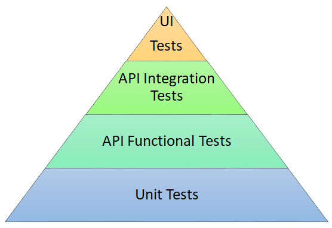

# Testing Standards
The standards we recommend are here to provide consistency and high quality across all Insight-developed IP.  The tooling standards outlined below are recommendations based on broad industry usage and preferences within the org.  They are not absolute requirements - _better to have tests using other tools than to not have tests at all_.

## Testing Approach
In your test approach, we suggest following the testing pyramid as shown below. You can assume that every step within the triangle is an automated test run within a CI/CD pipeline. For automation, the goal is to maintain roughly 70% Unit Tests, 20% API tests, and 10% UI Tests. For example, if we have a total of 3,000 tests, there should be 2,100 Unit Tests, 600 API Tests, and 300 UI Tests.  The goal is to always maintain as close to this ratio of tests as possible.

## Unit Testing
Unit tests should be a standard of every solution. It is the lowest level of testing which gives us the quickest form of component feedback. Developers should be adding new unit tests along the way as new code is created. Catching tests at this level helps with the quality of the product as more code is built upon existing code. Unit test frameworks of choice are:

#### .NET
- MSTest: https://docs.microsoft.com/en-us/dotnet/core/testing/unit-testing-with-mstest
- Moq: https://github.com/moq/moq4

#### Java
- JUnit: https://junit.org/junit5/
- Mockito: https://site.mockito.org/

#### Python

unittest is a framework which is packaged with Python.
- unittest: https://docs.python.org/3/library/unittest.html
- unitest.mock: https://docs.python.org/3/library/unittest.mock.html

PyTest is a 3rd party unit testing framework which makes writing test code more succinct. monkeypatch is also part of the PyTest package.

- PyTest: https://docs.pytest.org/
- monkeypatch: https://docs.pytest.org/en/6.2.x/monkeypatch.html?highlight=mock

Some code segments are not able to be unit tested (such as calls to external services), so those segments should be tagged with an attribute that declares them as such. Ideally external service integration is isolated behind interfaces and using dependency injection can be mocked to 'fake' calls to external functionality and validate that those calls are happening properly.

## API Functional & Integration Testing
API Functional & Integration tests should be present on all API solutions.  The standard for these type of API testing frameworks of choice are:
- Postman: https://www.postman.com
- Newman: https://learning.postman.com/docs/running-collections/using-newman-cli/command-line-integration-with-newman

For functional testing without having a server in place, postman contains a feature that which will allow you to create a mock server.  This mock server will allow you to see how your return data could look. For more information, see the [Mocking with examples](https://learning.postman.com/docs/designing-and-developing-your-api/mocking-data/mocking-with-examples/) page in the postman Learning Center.

API integration tests generally need a fully deployed environment to operate, but sometimes a pseudo-environment using containers can be created to run integration tests right in a pipeline. https://www.testcontainers.org/.  

### Auto-generated API Tests

As a part of API testing, there are some areas of testing which you should cover:
* Contract Testing
* Performance Testing
* Security Testing

For each of the testing types, we provide some tools which you can use to automatically generate these test types.  Below are the links to each within the InsightAppsAndData
 organization.
 * [Postman Contract Test Generator](https://github.com/InsightAppsAndData/postman-contract-test-generator)
 * [Postman Performance Test Generator](https://github.com/InsightAppsAndData/postman-performance-test-gen)
 * [Postman Security Test Generator](https://github.com/InsightAppsAndData/postman-security-test-generator)

## Browser Unit & Integration Testing
Both unit and integration testing are highly recommended for Typescript/Javascript libraries, Angular Components, or other web browser-based applications. The tools of choice for testing browser-based libraries and applications are:
- Cypress: https://www.cypress.io/

## Mobile Testing

### Android
[Espresso](https://developer.android.com/training/testing/espresso) is an Android UI Testing Framework.

A list of Espresso samples can be found on the Additional Resources page of for Espresso: https://developer.android.com/training/testing/espresso/additional-resources#samples

### iOS
[XCode](https://developer.apple.com/xcode/) is for developing and testing iOS mobile applications.

### Xamarin
[Xamarin](https://dotnet.microsoft.com/en-us/apps/xamarin) is a .Net cross-platform for developing mobile applications.  

Currently, Microsoft has released the next version of Xamarin as a preview only. Today Xamarin.Forms are used to create applications, but the next version will use the .NET Multi-platform App UI (or .NET MAUI). For more information on MAUI, please see the [.NET Multi-platform App UI documentation](https://docs.microsoft.com/en-us/dotnet/maui/).